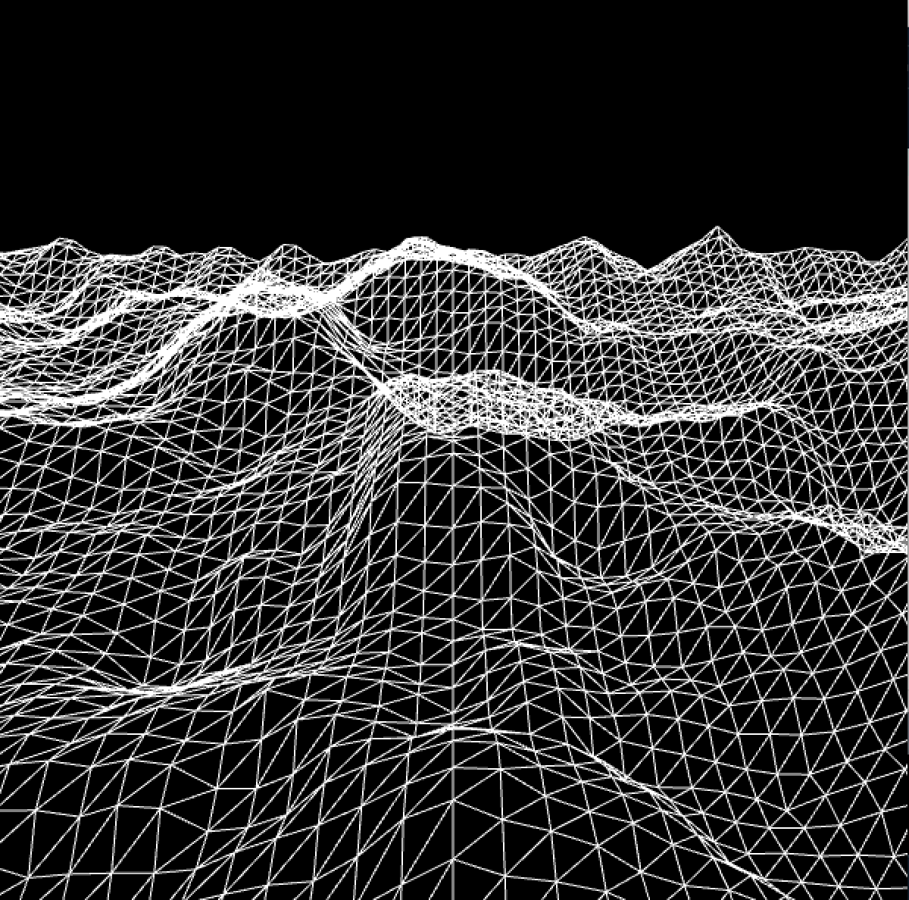

### Flow Fields Pretty

Calculates flow field which then effects the movement of particles.

### Noise Terraine

Creates a grid of x, y points, which are impacted by an offset of noise. Then presents these through the use of a triangle_strip.

### Pixel Noise

Each pixel is given a noise value for its RGB value - thus showing the progression of noise, from one pixel to another

Based on [Coding Rainbow](http://codingrainbow.com/)
